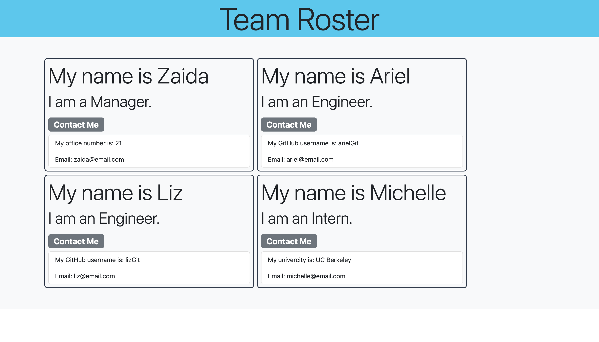

<h1>teamProfileGenerator</h1>

## Table of Contents

  * [Description](#description)
  
  * [Installation](#installation)

  * [Usage](#usage)

  * [Links](#links)

  * [Questions](#questions)

## Description

- My motivation to create an terminal application that a team manager could use to create a team roster.
- I built this project to expand my knowledge in javasript and node.js and how to more efficiently use command-line features.
- It allows user to create a roster with as many employees quick and efficiently by imputtig emloyees info without having to write or code for the DOM.
- Learned how to write tests for class constructors and use promises more efficiently and call functions within them.

## Installation

- Clone code from GitHub repository:
- Open in VS Code and command-line terminal.
- Type 'node index.js' to start application. 

## Usage
  
 - After typing 'node index.js' in command-line terminal, enter employees infortion in the prompt adding as many employees as needed till everyone on the team has been entered.

    
 

## Links

- GitHub: https://github.com/Caliza/teamProfileGenerator
- Google Drive: https://drive.google.com/file/d/1ALz30f3SrgSaZBSmH7cDouA3KW2eJBVD/view?usp=share_link
- Castify: https://watch.screencastify.com/v/fD59smaSSiK2HDfxPrfA

## Questions

- For any additional questions on usage of application, please contact at rances.rodriguez@gmail.com.